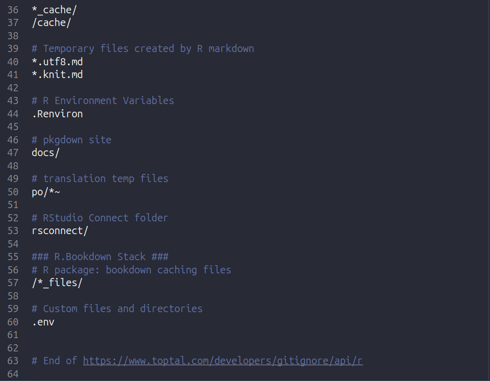

```{r setup, include=FALSE}
knitr::opts_chunk$set(echo = TRUE)
knitr::opts_chunk$set(eval = FALSE)
```

# 1 Project Setup

Here we will go over how to create a local project directory (or folder as it is commonly known) on your own personal computer.

## 1.1 Create a R Studio Project

1. Download the latest versions of R and RStudio. As of writing this tutorial, the latest version of R is 4.4.2, and RStudio is '2024-12.0.467'.

2. In RStudio, create a new project (.proj) in a new directory. By using an R project, you can create a new directory to store all of your code scripts and data files, as well as keep track of your workflow. You can find more information [here](https://support.posit.co/hc/en-us/articles/200526207-Using-RStudio-Projects).

    a. Click the 'Create git repository' and 'use renv' check boxes.

### 1.1.1 Git

[Git](https://git-scm.com/) is a version control system, which allows you keep track of changes to your project, and collaborate with colleagues if you use Github.

### 1.1.2 renv

[Renv](https://rstudio.github.io/renv/articles/renv.html) stands for 'R Virtual Environment', which creates reproducible environments for your R projects. Many new data scientists would download all their individual packages into one location, usually the R library. While this global (i.e. accessible anywhere on your computer) library is convenient, certain packages or package versions can conflict with each other, causing errors and preventing you from analyzing your data. With renv, you can download all the packages for your project in your project directory, which will lead to fewer problems due to conflicting packages/versions.

```{r eval=FALSE}
install.packages('renv')
library(renv)

renv::activate()
```

## 1.2 Create a '.env' file

For NodeJs and Python projects, many data scientists use environment variables to store sensitive data such as passwords, API credentials, and other info that should not be publicly shared. These environment variables can then be accessed by the R project without displaying the sensitive information on your R script.

To store the environment variables, use a '.env' file and the R package 'dotenv'.

In a terminal window, run the following command to create a .env file in your project directory and store your CTT API key:
```{bash}
touch .env

echo "API_KEY=your_api_key" >> .env
```    

```{r eval = FALSE}
install.packages('dotenv')
library(dotenv)

# load the env file
load_dot_env(file='.env')

# get your api key from the env file
my_token <- Sys.getenv('API_KEY')
```

### 1.2.1 Add .env file to .gitignore

Finally, you will need to add the .env file to the .gitignore file, so that when you commit changes to your R project the .env file is not included. That way your environmental variables will stay on your computer until you share them with collaborators.

Open the .gitignore file in RStudio and add '.env' (without the quotes) to the file and save it.


You are now ready to start downloading data!

## 1.3 Organize your Project Directory

In your project directory create the following folders to organize your files:

* src - where you store your .R scripts
* data - store downloaded data from CTT and modified dataframes
* results - store plots and tables