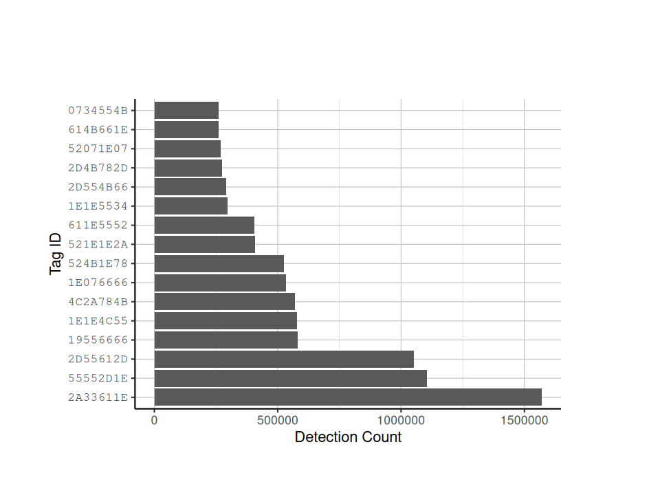
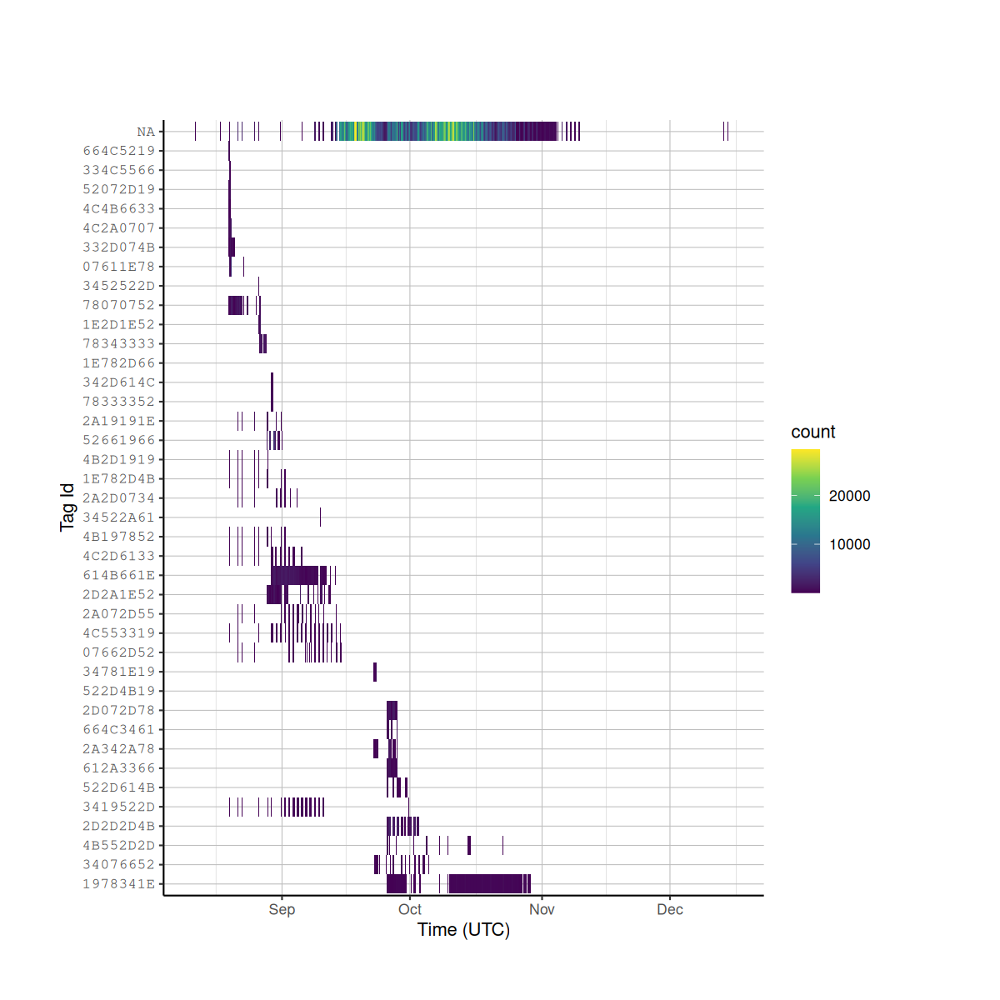
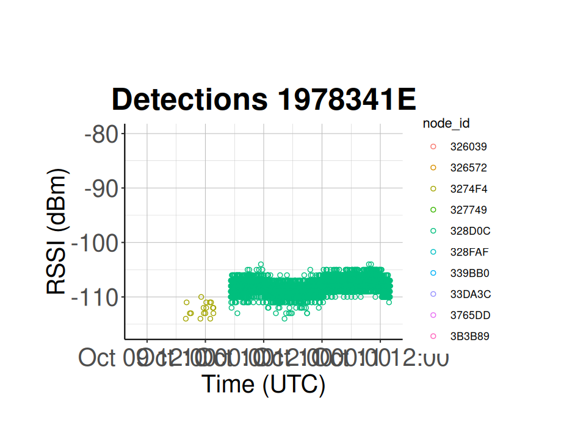

```{r, include=FALSE}
knitr::opts_chunk$set(echo = TRUE)
knitr::opts_chunk$set(eval = FALSE)
```

# Presence/Absence Analysis

This type of analysis can be used to answer questions on stopover duration or for threat monitoring at airports, windmills, etc.

You will need to manually create a tag deployment csv file. This file will contain:
* the tag id (all uppercase)
* the tag deployment date
* the standardized 4-letter Alpha code (if your study involves birds)
* the tag type (Power, Life, Blu)
* the antenna type (1/8 wave)
* any other characteristics of the individual wearing the tag (sex, weight, etc.).

Ex.

|TagId|DeployDate|Species|TagType|AntennaType|
|-----|----------|-------|-------|-----------|
|332D074B|09/03/23|NOWA|Power|1/8 wave|
|664C5219|08/23/23|NOWA|Power|1/8 wave|
|4C2A0707|08/20/23|NOWA|Power|1/8 wave|

Then move that tag deployment file into the 'outpath' folder.

The `celltracktech` package includes the deployments data for the Meadows V2 project. We will import it into the RStudio environment and save it as a .csv file in the `data/Meadows V2/` folder for this tutorial. 

```{r}
write_csv(celltracktech::deployments, './data/Meadows V2/meadows_deployments_2023.csv')
```

If you are using your own data, move your project-specific deployments .csv file into your `data/<project name>/` folder.

We are now ready to start calculating presence/absence.

## Set parameters
```{r}
options(digits = 10)

# Specify the path to your database file
database_file <- "./data/Meadows V2/meadows.duckdb"

# Specify the path to the deployment info file
deployment_info_file <- "data/Meadows V2/meadows_deployments_2023.csv"

# Specify the time range of node data you want to import for this analysis
start_time <- as.POSIXct("2023-08-01 00:00:00", tz = "GMT")
stop_time <- as.POSIXct("2023-12-31 00:00:00", tz = "GMT")
```

## Load data from database
```{r}
# Load from DB
con <- DBI::dbConnect(duckdb::duckdb(), 
                      dbdir = database_file, 
                      read_only = TRUE)

# load the raw data table in to RStudio and subset it based on your start and stop times
detection_df <- tbl(con, "raw") |> 
  filter(time >= start_time & time <= stop_time) |>
  collect()

# if you study uses blu tags, load the blu data table into RStudio
# detection_blu <- tbl(con, "blu") |> 
#   filter(time >= start_time & time <= stop_time) |>
#   collect()

# disconnect from database
DBI::dbDisconnect(con)
```

## Load Tag Deployment Info

### Load Tag Deployment File

Again, you will need to create this file yourself. You might want to include other info about the individuals in this file for later analysis (species, weight, sex, etc.).

```{r}
deployment_df <- read_csv(deployment_info_file)
```

### Get List of Detected Tags
```{r}
# count the number of detections for each tag. the minimum number of detections to be included in this dataframe is 250000. You can set the `min_det_count` to whatever is appropriate for your study.
tag_det_count <- get_tag_detection_count(detection_df, min_det_count = 250000)

# plot the number of detections for each individual tag
ggplot(tag_det_count, 
       aes(x = factor(x = tag_id,
                      levels = tag_id), 
           y = n)) +
  geom_bar(stat = "identity") +
  coord_flip() +
  labs(x = "Tag ID", 
       y = "Detection Count") +
  tag_hist_plot_theme()
```


## Generate Detection Summary

While it is good to know how many detections an individual tag has, it is better to know how many detections there were across time. The code chunk below will subset your `detection_df` based on the tags in your tag deployment file, and create a plot of detections across time.
```{r}
# Discard detections that aren't from deployed tags
detection_df <- subset.data.frame(detection_df, 
                                  tag_id %in% deployment_df$TagId) |>
                              filter(is.na(tag_id) == FALSE)

# OPTIONAL: You can select individual species here
# subsetting the deployment dataframe to only include NOWA or northern waterthrush
deployment_df <- subset.data.frame(deployment_df,
                                   Species == "NOWA")
# detection_df <- subset.data.frame(detection_df,TagId %in% deployment_df$TagId)

det_summary_df <- detection_summary(
  detection_df = detection_df,
  tag_list = deployment_df$TagId
)

# create detection summary data frame and sort it based on last detection date
det_summary_df <- det_summary_df[order(det_summary_df$last_det, decreasing = TRUE), ]

# create a heat-bin plot, with the bins reperesenting time periods, and the color representing the number of detections
ggplot(data = detection_df, 
       aes(x = time, 
           y = factor(tag_id, 
                      det_summary_df$tag_id))) +
  geom_bin2d(binwidth = c(3600, 1)) + # Hour time bins
  scale_fill_continuous(type = "viridis") +
  labs(x = "Time (UTC)", 
       y = "Tag Id") +
  tag_hist_plot_theme()
```



## Show Detection History for a Specific Tag

```{r}
# selected tag is a power tag on a swamp sparrow
selected_tag_id <- "1978341E"

# set your start and stop times
plot_start_time <- as.POSIXct("2023-10-09 10:00:00", tz = "GMT")
plot_stop_time <- as.POSIXct("2023-10-11 14:00:00", tz = "GMT")

# subset the detection_df to only include the selected tag id
tag_dets <- subset.data.frame(detection_df, tag_id == selected_tag_id)

# plot the number of detections for this specific tag at each node across time
ggplot(tag_dets) +
  geom_point(aes(x = time, 
                 y = tag_rssi, 
                 colour = node_id), 
             shape = 1) +
  xlim(as.POSIXct(plot_start_time), 
       as.POSIXct(plot_stop_time)) +
  ggtitle(paste("Detections", 
                selected_tag_id)) +
  xlab("Time (UTC)") +
  ylab("RSSI (dBm)") +
  classic_plot_theme()
```

