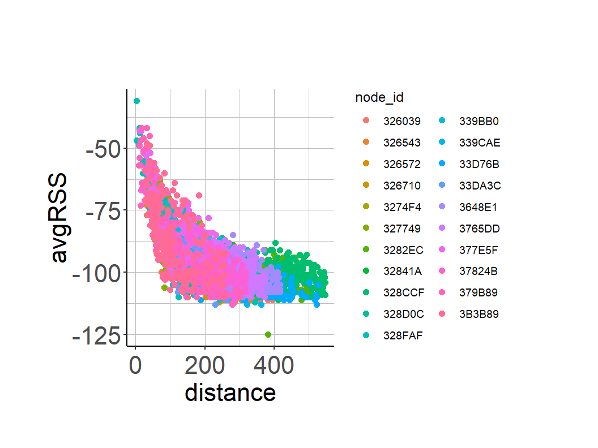
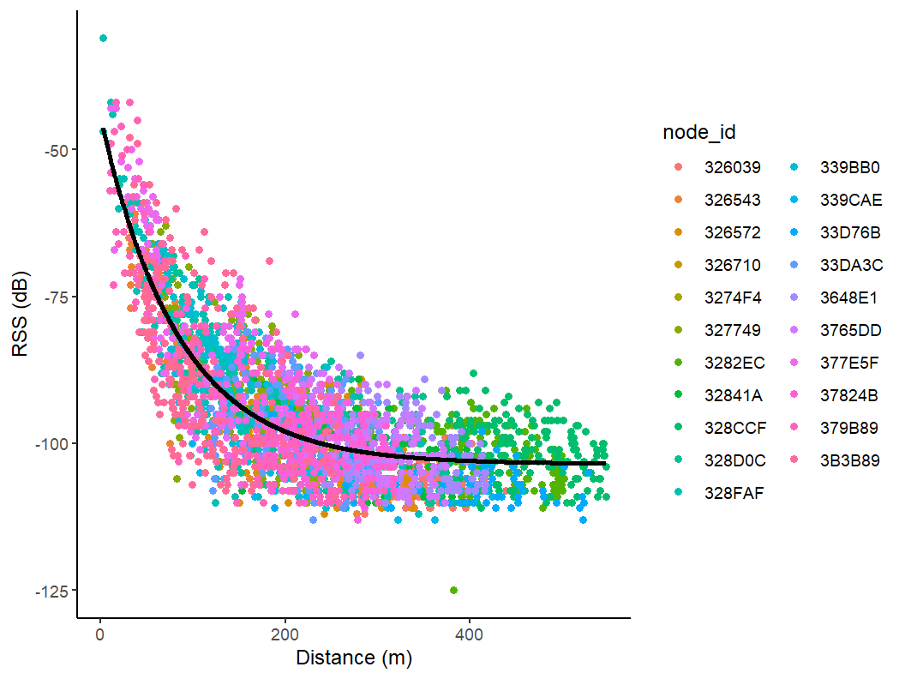
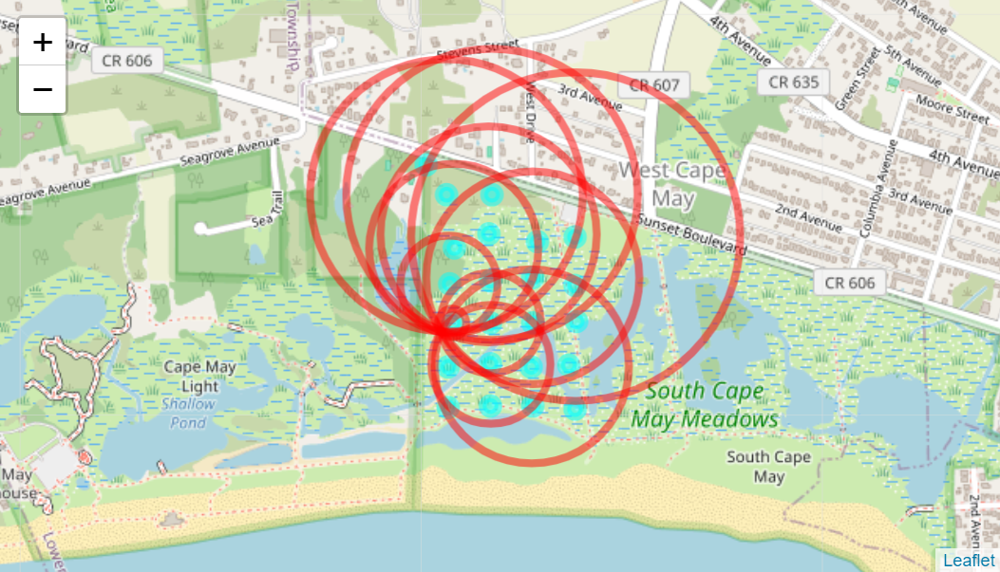

```{r, include=FALSE}
knitr::opts_chunk$set(echo = TRUE)
knitr::opts_chunk$set(eval = FALSE)
```

# Multilateration
This process is just like habitat use and grid search analysis, but instead of using the RSSI, it uses time difference of arrival instead to calculate the location of an animal.

You should use this method when your node grid is evenly spaced.

[Multilateration paper](https://pubmed.ncbi.nlm.nih.gov/35169450/)

## Load settings

### Reset R's brain, remove all previous objects
```{r}
rm(list=ls())
tagid = c("072A6633","2D4B782D") #"0C5F5CED"
timezone="UTC"
options(digits=9) # sets number after decimal
```

### Load libraries
```{r}
library(celltracktech)
```

### Re-create sample data from node calibration (Chapter 5)
```{r}
# create time window by reducing location precision or can input data with TestId column (user-defined window)

# load node calibration file from Chapter 5
# mytest <- read.csv("./calibration_2023_8_3_all.csv")
mytest <- read.csv("./data/Meadows V2/sidekick/calibration_2023_8_3_all.csv")
mytest$Time <- as.POSIXct(mytest$time_utc, tz="UTC")

# connect to database
con <- DBI::dbConnect(duckdb::duckdb(), 
                      dbdir = "./data/Meadows V2/meadows.duckdb", 
                      read_only = TRUE)

# filter for specific dates and for the specified tags in tag id
testdata <- tbl(con, "raw") |> 
  filter(time >= as.Date("2023-07-31") && time <= as.Date("2023-10-31")) |>
  filter(tag_id %in% tagid) |>
  collect()

# set node start and stop dates
start_buff = as.Date("2023-08-01", tz="UTC")
end_buff = as.Date("2023-08-07", tz="UTC")

nodehealth <- tbl(con, "node_health") |>
  filter(time >= start_buff  && time <= end_buff) |>
  collect()

# disconnect from database
DBI::dbDisconnect(con)

# create dataframe of nodes and their locations (lat, lon)
nodes <- node_file(nodehealth)
```

## Isolate raw Received Signal Strength (RSS) data from Node network associated with Test Data
```{r}
combined_data <- data.setup(mytest, 
                            testdata, 
                            nodes, 
                            tag_col = "tag_id", 
                            tagid = "072A6633", 
                            time_col = "Time",
                            timezone = "UTC",
                            x = "lon",
                            y = "lat", 
                            loc_precision = 6, 
                            fileloc = "./data/Meadows V2/meadows.duckdb", 
                            filetype = "raw")
```

## Exponential Decay Function - Relationship between Distance and Tag RSS Values
```{r}
# Plot of the relationship between RSS and distance
ggplot(data = combined_data, 
       aes(x = distance, 
           y = avgRSS, 
           color = node_id)) + 
  geom_point(size = 2)
```

As distance increases, we see average RSS decreasing exponentially.

### Preliminary Exponential Decay Model - Determine starting values for the final model

* SSasvmp - self start for exponential model to find the data starting values
* Asvm - horizontal asymptote (when large values) - y values decay to this value
* R0 - numeric value when avgRSS (i.e., response variable) = 0
* lrc - natural logarithm of the rate constant (rate of decay)

```{r}
# preliminary model - non-linear sampling
exp.mod <- nls(avgRSS ~ SSasymp(distance, 
                                Asym, 
                                R0, 
                                lrc), 
               data = combined_data)

  # Summary of Model
summary(exp.mod)
  # rate of decay
exp(coef(exp.mod)[["lrc"]])
```

### Final Exponential Decay Model

User provides self-starting values based on visualization of the data and values in the Preiliminary Model Output

exponential model formula: avgRSS ~ a * exp(-S * distance) + K

* a = intercept
* S = decay factor
* K = horizontal asymptote

```{r}
##  ***** Variables to define for final model below - replace values below with values from exp.mod ****  ## 
a <- coef(exp.mod)[["R0"]]
S <- exp(coef(exp.mod)[["lrc"]])
K <- coef(exp.mod)[["Asym"]]
  
  # Final Model
nls.mod <- nls(avgRSS ~ a * exp(-S * distance) + K, 
               start = list(a = a, 
                            S = S, 
                            K= K), 
               data = combined_data)

  # Model Summary
summary(nls.mod)

  # Model Coefficients 
coef(nls.mod)

## Check the fit of the model and get predicted values
  # Get residuals and fit of model and add variables to main table
combined_data$E <- residuals(nls.mod)
combined_data$fit <- fitted(nls.mod)

  # Plot residuals by fit or distance
#ggplot(combined_data, aes(x = distance, y = E, color = node_id)) +
#        geom_point(size = 2)

#ggplot(combined_data, aes(x = fit, y = E, color = node_id)) +
#  geom_point(size = 2)

  # Get model predictions
combined_data$pred <- predict(nls.mod)

## Plot with predicted line
ggplot(combined_data, aes(x = distance,
                          y = avgRSS, 
                          color=node_id)) + 
  geom_point() +
  geom_line(aes(y = pred), color="black", lwd = 1.25) +
  scale_y_continuous(name = "RSS (dB)") +
  scale_x_continuous(name = "Distance (m)") +
  theme_classic()
```


```{r}
a <- unname(coef(nls.mod)[1])
S <- unname(coef(nls.mod)[2])
K <- unname(coef(nls.mod)[3])

combined_data <- estimate.distance(combined_data, K, a, S)

tile_url = "https://tile.openstreetmap.org/{z}/{x}/{y}.png"
testout <- combined_data[combined_data$TestId==0,]
leaflet() %>%
    addTiles(
      urlTemplate = tile_url,
      options = tileOptions(maxZoom = 25)
    ) %>%
    addCircleMarkers(
      data = nodes,
      lat = nodes$node_lat,
      lng = nodes$node_lng,
      radius = 5,
      color = "cyan",
      fillColor = "cyan",
      fillOpacity = 0.5,
      label = nodes$node_id
    )  %>%
    addCircles(
      data=testout, 
      lat = testout$node_lat,
      lng = testout$node_lng,
      radius = testout$distance,
      color = "red",
      #fillColor = "red",
      fillOpacity = 0)
```


```{r}
no.filters <- trilateration.TestData.NoFilter(combined_data)
RSS.FILTER <- c(-80, -85, -90, -95)
RSS.filters <- trilateration.TestData.RSS.Filter(combined_data, RSS.FILTER)
#DIST.FILTER <- c(315,500,750,1000)
# Calculate error of location estimates of each test location when Distance filters are applied prior to trilateration 
#Dist.filters <- trilateration.TestData.Distance.Filter(combined_data, DIST.FILTER)

SLIDE.TIME <- 2
GROUP.TIME <- "1 min"

test_data <- testdata %>%
  filter(time >= as.Date("2023-10-05") & time <= as.Date("2023-10-15")) %>%
  filter(tag_id == "2D4B782D") %>%
  collect()

# Function to prepare beep data for trilateration 
# by estimating distance of a signal based on RSS values
beep.grouped <- prep.data(test_data,
                          nodes,
                          SLIDE.TIME,
                          GROUP.TIME,
                          K, 
                          a, 
                          S) 

RSS.filter <- -95
location.estimates <- trilateration(beep.grouped, nodes, RSS.FILTER)

# this will take a while...
mapping(nodes, location.estimates)
```